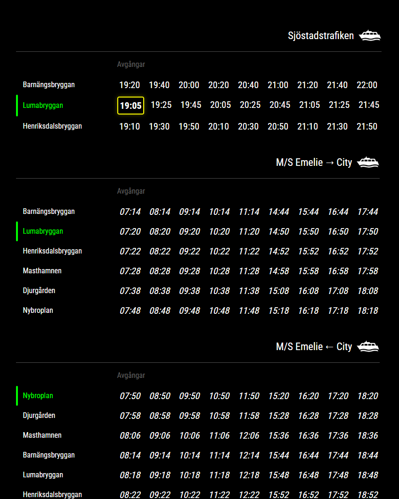
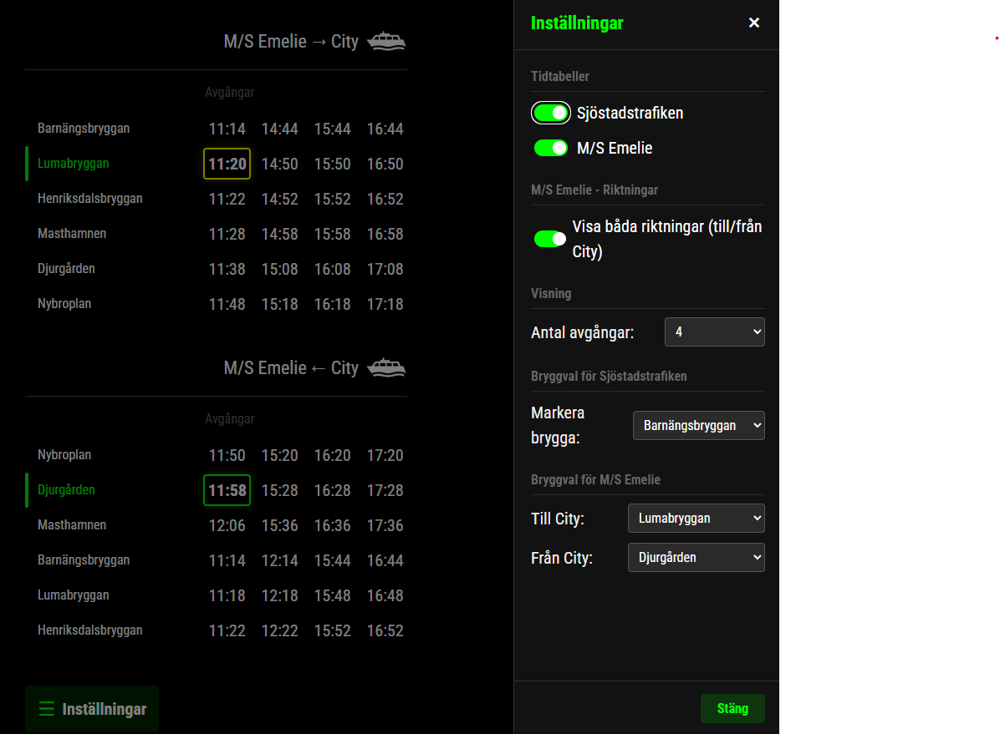

# Sjöstadsfärjetrafiken





En modern, helt statisk webbapplikation för att visa realtidstidtabeller för båtlinjerna i Hammarby Sjöstad: **Sjöstadstrafiken** och **M/S Emelie**.

**Live-demo:**  
https://minaprojekt.github.io/ressel-timetable/

---

## Funktioner

- Realtidsvisning – Avgångar uppdateras automatiskt varje minut
- Smart tidmarkering:
  - 🟢 Grön ram = Nästa avgång (mer än 10 minuter)
  - 🟡 Gul ram = Snar avgång (mindre än 10 minuter)
  - *Kursiv text* = Morgondagens första avgångar
- Flexibel visning av linjer och antal avgångar
- Brygganpassning för snabb överblick
- Mörkt tema – även lämpat för digital skyltning
- Offline-stöd via service worker
- Mobilvänlig / PWA – kan installeras som app
- Automatisk hantering av helgdagar

---

## Kom igång

### Snabbstart
1. Öppna https://minaprojekt.github.io/ressel-timetable/
2. Klart 🎉

### Lokal användning
Applikationen är helt statisk och kräver ingen build-process.

```bash
python3 -m http.server 8000
# Öppna http://localhost:8000
```

Du kan även öppna `index.html` direkt i webbläsaren.

---

## Hosting

Projektet fungerar på vilken webbserver som helst.

### Apache
```bash
sudo cp -r . /var/www/html/farjetrafiken
sudo chmod -R 755 /var/www/html/farjetrafiken
```

### Nginx
```nginx
server {
    listen 80;
    server_name farjetrafiken.example.com;
    root /var/www/farjetrafiken;
    index index.html;

    location / {
        try_files $uri $uri/ =404;
    }

    location ~* \.json$ {
        add_header Cache-Control "no-cache, must-revalidate";
    }
}
```

---

## Projektstruktur

```
ressel-timetable/
├── index.html
├── manifest.json
├── service-worker.js
├── css/
├── js/
├── data/
└── icons/
```

---

## Deployment

Projektet deployeras automatiskt till GitHub Pages direkt från `main`-branchen.

Varje `git push` publicerar ändringarna.

---

## Bidra

Issues och pull requests är välkomna:  
https://github.com/minaprojekt/ressel-timetable/issues

---

## Licens

MIT License.  
Fri användning, modifiering och distribution är tillåten, med krav på attribution till upphovspersonen.

Se `LICENSE` för fullständig text.

---

## Upphovsperson & kontakt

**Christian Gillinger**  
📧 christian.gillinger@proton.me
